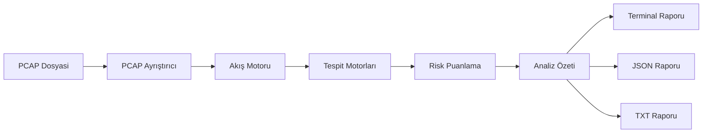

# P4CKET

**P4CKET** (Packet), PCAP ve PCAPNG dosyalarini analiz eden, ağ trafiğindeki şüpheli davranışları tespit eden ve tüm analiz sonuçlarini tek bir masaüstü arayüzünde gösteren profesyonel bir savunma amaçlı siber güvenlik aracidir.

## Ozellikler

- **PCAP/PCAPNG Desteği**: Scapy ile offline PCAP okuma
- **Akis Rekonstruksiyonu**: 5-tuple (kaynak IP, hedef IP, kaynak port, hedef port, protokol) akis normalizasyonu
- **Port Tarama Tespiti**: Kısa sürede çok sayıda farklı porta bağlantı denemesi
- **SYN Anomalisi**: Aşırı SYN trafiği tespiti
- **ICMP Anomalisi**: Anormal ICMP trafik yoğunluğu
- **UDP Anomalisi**: Anormal UDP trafik yoğunluğu
- **DNS Anomalisi**: Yüksek sorgu hacmi, NXDOMAIN, uzun sorgu adları, yüksek entropi
- **Periyodik Iletisim**: Düzenli aralıklarla tekrar eden bağlantılar
- **Risk Puanlama**: 0-100 arası merkezi risk puanlama sistemi
- **Masaüstü Arayüz**: PySide6 ile geliştirilmiş koyu tema arayüz
- **JSON/TXT Raporu**: Yapılandırılmış rapor çıktısı
- **Çoklu Is Parçacığı**: GUI donmadan arka planda analiz
- **Modüler Mimari**: Yeni tespit motorları kolayca eklenebilir

## Mimari



## Kurulum

### Gereksinimler

- Python 3.11+
- Windows 10/11

### Adımlar

```bash
# Bagimliliklari yukle
pip install -r requirements.txt

# Uygulamayi baslat
python main.py
```

### PyInstaller ile EXE Oluşturma

```bash
pip install pyinstaller
pyinstaller P4CKET.spec
```

Cıktı `dist/P4CKET.exe` dosyasinda olacaktır.

## Kullanim

1. Uygulamayi baslat: `python main.py`
2. `PCAP DOSYASI SEC` butonuna tikla
3. Analiz edilecek `.pcap` veya `.pcapng` dosyasini sec
4. `ANALIZI BASLAT` butonuna tikla
5. Tespit motorlari otomatik olarak calisacak
6. Sonuclar tek ekranda toplanacak
7. Bir bulguya tiklayarak detaylari gor
8. `RAPORU KAYDET` ile JSON veya TXT raporu indir

## Tespit Motorlari

### Port Tarama
Kaynak IP'den çok sayıda farklı porta bağlantı denemesi tespit edilir.

### SYN Anomalisi
Belirli bir zaman diliminde aşırı SYN paketi gönderimi tespit edilir.

### ICMP Anomalisi
Anormal seviyede ICMP trafiği tespit edilir.

### UDP Anomalisi
Anormal UDP trafik yoğunluğu tespit edilir.

### DNS Anomalisi
Yüksek sorgu hacmi, fazla NXDOMAIN, uzun sorgu adları ve yüksek entropi tespit edilir.

### Periyodik Iletisim
İki host arasinda düzenli aralıklarla tekrar eden bağlantılar tespit edilir.

## Risk Puanlama

| Seviye | Puan Aralığı |
|--------|--------------|
| DÜŞÜK  | 0 - 39       |
| ORTA   | 40 - 69      |
| YÜKSEK | 70 - 89      |
| KRİTİK | 90 - 100     |

## Proje Yapısı

```
P4CKET/
├── p4cket/
│   ├── __init__.py
│   ├── arayuz/
│   │   ├── ana_pencere.py
│   │   ├── tema.py
│   │   ├── tablolar.py
│   │   └── diyaloglar.py
│   ├── motor/
│   │   ├── pcap_ayristirici.py
│   │   ├── akis_motoru.py
│   │   ├── analiz_motoru.py
│   │   └── puanlama.py
│   ├── tespit/
│   │   ├── port_tarama.py
│   │   ├── syn_anomalisi.py
│   │   ├── icmp_anomalisi.py
│   │   ├── udp_anomalisi.py
│   │   ├── dns_anomalisi.py
│   │   └── periyodik_iletisim.py
│   ├── modeller/
│   │   ├── __init__.py
│   │   ├── paket_kaydi.py
│   │   ├── ag_akisi.py
│   │   ├── tehdit_bulgusu.py
│   │   └── analiz_ozeti.py
│   ├── rapor/
│   │   ├── json_rapor.py
│   │   └── txt_rapor.py
│   └── yardimci/
│       ├── sabitler.py
│       └── gunluk.py
├── testler/
│   ├── test_pcap.py
│   ├── test_port_tarama.py
│   ├── test_syn.py
│   ├── test_icmp.py
│   ├── test_udp.py
│   ├── test_dns.py
│   ├── test_periyodik.py
│   ├── test_puanlama.py
│   └── test_rapor.py
├── araclar/
│   └── ornek_pcap_olustur.py
├── ornekler/
│   └── README.md
├── ekran_goruntuleri/
├── main.py
├── requirements.txt
├── pyproject.toml
├── README.md
├── LICENSE
├── .gitignore
└── P4CKET.spec
```

## Testler

```bash
pytest testler/ -v
```

## Sinirlamalar

- Yalnızca offline PCAP/PCAPNG dosyalarını analiz eder
- Canlı trafik yakalama yapmaz
- Şifreli içerikleri (TLS vb.) incelmez
- Heuristic tabanlı tespit yapar; yanlış pozitif olasiligi vardir
- Windows 10/11 ile test edilmiştir

## Yanlis Pozitif Hususlari

- Legitim port tarama araçları (nmap vb.) port tarama uyarisi verebilir
- Yuksek DNS sorgu hacmine sahip legitim çözümler DNS uyarisi verebilir
- Heartbeat mekanizmalari periyodik iletisim uyarisi verebilir
- Bulguları her zaman ağ ortamı bağlaminda dogrulayin

## Sorumlu Kullanim

P4CKET yalnızca savunma ve analiz amacıyla kullanılır. Sadece sahip olduğunuz veya açıkça izin aldığınız trafiği analiz edin.

## Lisans

MIT License - see [LICENSE](LICENSE)

## Yol Haritasi

- [ ] TLS parmak izi (JA3/JA3S)
- [ ] HTTP anomali tespiti
- [ ] Daha fazla akis özelliği
- [ ] PCAPng gelişmiş desteği
- [ ] Yapılandırma dosyasi (JSON/YAML)
- [ ] Özel tespit motoru eklenti sistemi
